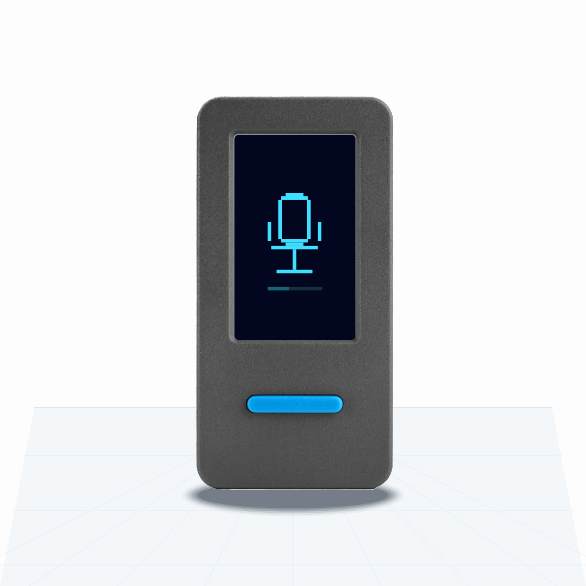
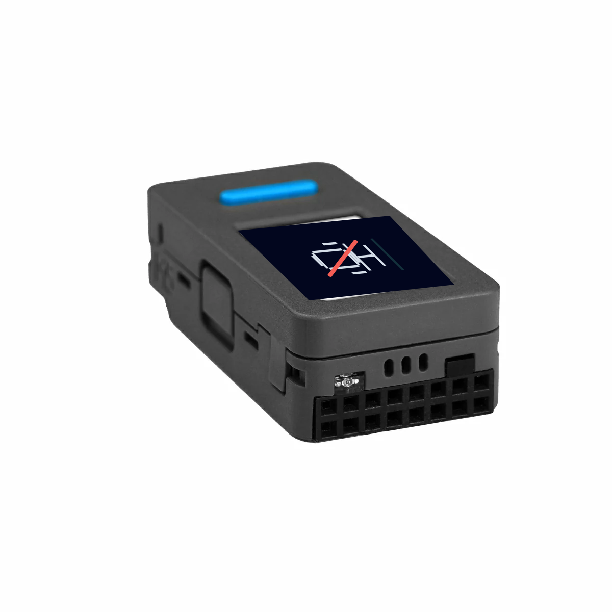

# voxstick

> **[简体中文 README](README.zh.md)** — 中文版本带微信输入法配置详细教程

USB push-to-talk dictation stick for macOS / Windows, built on the
M5Stack StickS3 (ESP32-S3).

The stick is a single composite USB device that hosts see as **both** a
16 kHz microphone *and* a HID keyboard. Tap the front button to toggle
voice input, long-press to send (Enter). Lay the stick flat on a desk with
the screen facing up and the IMU mutes the mic automatically. No drivers,
no companion app, plug-and-play on macOS / Windows / Linux.

## What it looks like

| StickS3 hardware | Upright = live mic | Flat, screen up = muted |
|---|---|---|
|  |  |  |

Product photos are referenced from the official
[M5Stack StickS3 documentation](https://docs.m5stack.com/en/core/StickS3).
The web installer uses drawn product images with VoxStick's LCD states placed
inside the real StickS3 screen.

## Recommended setup

For Chinese-with-mixed-English voice input we use **WeChat 输入法**
(WeType): it has the best handling for code-mixed speech plus
LLM-based correction we've seen. See [README.zh.md](README.zh.md) for
the step-by-step. Any whisper.cpp-based macOS dictation tool will also
work — VoiceInk, MacWhisper Pro, or macOS native Dictation.

## Why a hardware stick?

- **Real keyboard event**, not a global hotkey faked through Accessibility
- **Dedicated MEMS mic** + ES8311 codec, away from your laptop fan
- **Low-power status display** — dim backlight + small mic icon on the
  240×135 LCD; open mic, muted mic, and a tiny audio meter
- **IMU privacy mute** — face-up or face-down on a desk = mic muted

## Hardware

[M5Stack StickS3](https://docs.m5stack.com/en/core/StickS3) — ESP32-S3
+ ES8311 codec + MEMS mic + ST7789 LCD + BMI270 IMU + USB-C, ~$25.

## Install prebuilt firmware

The easiest path is the browser installer:

1. **Computer:** open <https://openbrt.github.io/voxstick/install-en.html> in
   desktop Chrome or Microsoft Edge.
2. **Hardware:** connect the M5Stack StickS3 to the computer over USB-C with a
   data-capable cable.
3. **Hardware:** hold the StickS3 side reset/PWR button for about 2 seconds.
   Release it when the internal green LED blinks; the StickS3 is now in
   download mode.
4. **This page:** click **Connect and flash**, choose the StickS3 serial port
   in the browser picker, and approve the install.
5. **Hardware:** after flashing, unplug USB, double-click the side PWR button
   to fully power off the StickS3, then plug USB back in.
6. **Computer OS / dictation app:** after the firmware boots, select
   `StickS3-Mic` in system sound input settings or your dictation app's
   microphone settings.

The installer is powered by
[ESP Web Tools](https://esphome.github.io/esp-web-tools/) and writes the
merged `voxstick-full.bin` image at flash offset `0x0`. The static installer
files live in [`docs/install-en.html`](docs/install-en.html) and
[`docs/install.html`](docs/install.html), with the firmware manifest in
[`docs/firmware/v0.1.4/manifest.json`](docs/firmware/v0.1.4/manifest.json).

If GitHub Pages is not enabled yet, publish this repository from the `docs/`
folder (`Settings > Pages > Deploy from a branch > main / docs`) and the URL
above will become live.

Command-line fallback:

```sh
curl -LO https://github.com/openbrt/voxstick/releases/download/v0.1.4/voxstick-full.bin
esptool.py --chip esp32s3 -p /dev/cu.usbmodem* write_flash 0x0 voxstick-full.bin
```

On Windows, replace the port with something like `COM5`.

Note: browser flashing may not reliably auto-reboot the StickS3 because the
board is battery-backed behind the M5PM1 PMIC. The official StickS3 button
operations are long press = download mode, double press = power off, and single
press = power on.

## Build

```sh
. $IDF_PATH/export.sh
idf.py build flash
```

ESP-IDF 5.5 + components fetched automatically by IDF Component
Manager (`espressif/usb_device_uac`, `espressif/esp_codec_dev`,
`espressif2022/bmi270`).

For chip recovery (no buttons), see [`tools/trigger-download.sh`](tools/trigger-download.sh).

## Button gestures

| Gesture | HID output | Use |
|---|---|---|
| Tap BtnA (< 600 ms) | `Right Cmd + F12` | Toggle WeType voice input (or any tool bound to ⌘+F12) |
| Hold BtnA (≥ 600 ms) | `Enter` | Send the dictated message |
| Hold BtnA at boot | (none) | Reboot to ROM download mode for safe re-flash |

## License

[MIT](LICENSE)

## Credits

- USB UAC scaffold inspired by [atomic14/esp32-usb-uac-experiments](https://github.com/atomic14/esp32-usb-uac-experiments)
- M5StickS3 PMIC + codec init pattern lifted from
  [m5stack/M5Unified](https://github.com/m5stack/M5Unified) and
  [m5stack/M5GFX](https://github.com/m5stack/M5GFX)
- Built on Espressif's
  [`usb_device_uac`](https://components.espressif.com/components/espressif/usb_device_uac),
  [`esp_codec_dev`](https://components.espressif.com/components/espressif/esp_codec_dev),
  and [`espressif2022/bmi270`](https://components.espressif.com/components/espressif2022/bmi270)
  components

See [SESSION-NOTES.md](SESSION-NOTES.md) for the bring-up postmortem
(PMIC L3B LDO, ES8311 `no_dac_ref` bug, M5PM1 BOOT-pin brick recovery,
and other rough edges).
